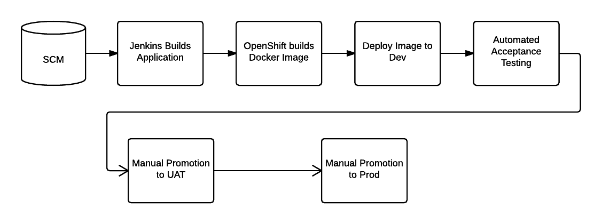

ose-jenkins-job-dsl
==============

Library to support a Continuous Delivery pipeline for OpenShift using Jenkins



## Components

* Continuous Integration
	* Jenkins CI Server
	* Artifact Repository (Nexus by default)
	* Docker client
* OpenShift V3 environment

## Jenkins Jobs

The following jobs are available

1. OseDevBuildJob - Pulls source code from a GitHub based repository, updates Maven project to support continuous deployment, builds and deploys artifact to Maven repository
2. OseTriggerDevJob - Updates the *SRC_APP_URL* environment variable of the BuildConfig within OpenShift and triggers a new build in OpenShift
3. OseAcceptanceJob - Performs an acceptance test within OpenShift to verify a Restful services endpoint is active (Can be omitted by not specifying an acceptance url in the configuration)
4. OsePromoteJob - Promotion of an image within the Integrated Docker registry from one environment/project to another
5. OseWorkflowJob - Builds a CI/CD process using the Jenkins [Workflow Plugin](https://wiki.jenkins-ci.org/display/JENKINS/Workflow+Plugin)

## Views

Visualizing of the chaining of jobs is facilitated using the [Delivery Pipeline Plugin](https://wiki.jenkins-ci.org/display/JENKINS/Delivery+Pipeline+Plugin). The *OseDeploymentPipelineView* job will produce a new pipeline view

## Getting Started

Setting up the deployment pipeline can be completed in a few simple steps. Please see the [setup document](docs/setup.md) and [prerequisites](docs/prerequisites.md) on how to configure your environment

## ChatOps

Notifications can be produced to keep teams engaged during the process of the delivery pipeline. The acceptance job allows for interaction with Slack to deliver a message when the application has passed the build and acceptance testing phase and is ready for promotion. This section describes how to configure Jenkins with the necessary information to communicate with Slack.

### Slack

Slack is a team communication tool that allow collaboration within an organization. Jenkins can utilize as a [Bot User](https://api.slack.com/bot-users) to post notifications to a Slack channel. After registering a new bot user, add the API token to Jenkins. Follow the "Adding secret text value to Jenkins" on how to store and utilize secure credentials to Jenkins

The following parameters can be added to the configuration file based on the id of the credential used to store the API token and the channel name to post messages within slack

```
"slackTokenCredential": "slack-token",
"slackChannelName": "#openshift-dev",
"slackUsername": "jenkins"
```

